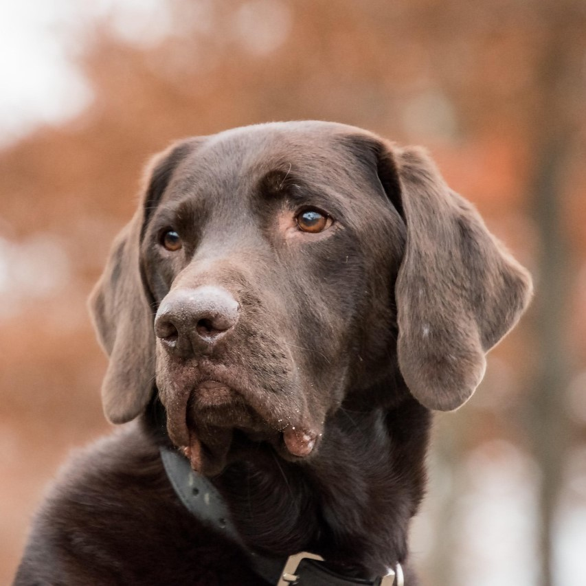
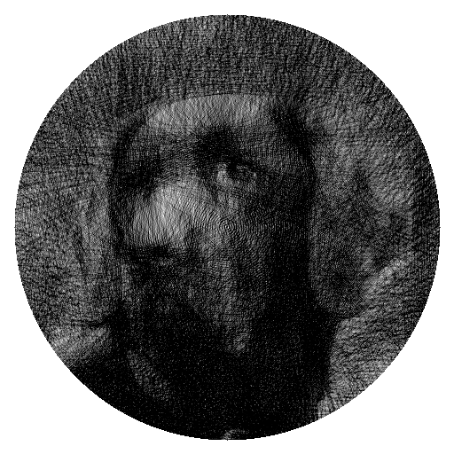
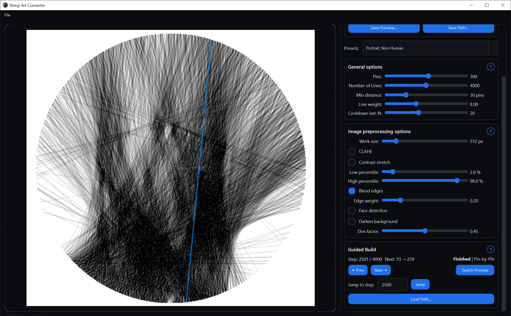

# StringArtConverter

Turn any image into **string art** - an image made entirely from threads connecting pins!<br>

Load a photo, choose a preset or fine-tune parameters, and automatically generate a sequence of nail-to-nail lines to recreate your image as physical string art.

*For most users, using one of the built-in presets gives the best results. Advanced users can experiment with the parameters for custom effects.*

<table>
  <tr>
    <td></td>
    <td align="center"><h1>&rarr;</h1></td>
    <td></td>
  </tr>
  <tr>
    <td align="center"><em>Before</em></td>
    <td></td>
    <td align="center"><em>After</em></td>
  </tr>
</table>


# Features

- **Desktop UI (PySide6):** Simple and interactive interface for parameter tuning and preview.
- **Preprocessing pipeline:** Optional background removal, face detection, and contrast enhancement.
- **String generation algorithm:** Greedy solver that connects nails to best approximate the source image.
- **Preview renderer:** Visualizes the final string pattern before you start the real build.
- **Pin-by-pin guidance:** Step-by-step instruction mode to help you recreate the piece in real life.

## Pin-by-pin

After generating a string path, you can start a guided **pin-by-pin session**.

This mode:
- Highlights which two pins to connect next.
- Shows your progress visually with the current step marked in blue.
- Lets you pause and resume your build anytime.

<table>
  <tr>
    <td></td>
  </tr>
  <tr>
    <td align="center"><em>UI while in pin-to-pin mode</em></td>
  </tr>
</table>

# Quick start

```
git clone https://github.com/Benedikt-K/StringArtConverter.git
cd StringArtConverter
```

## Conda / pip

Create a virtual environment and install all dependencies.

```
conda create -n StringArtConverter python=3.10 -y
conda activate StringArtConverter
pip install -r requirements.txt
```

## Start the app with

```
python main.py
```

Then use the User Interface for parameter selection and following conversion.
After that the pin-py-pin mode can be used to give instructions for translating the generated path into a nice real-life Art piece.

# Structure

```
StringArtConverter/
├─ main.py                  # file to start app from
├─ StringArtConverter/
│  ├─ UI/
│  │  ├─ app_styles.py      # CSS Sytle sheet
│  │  ├─ main_window.py     # Main UI layout and logic
│  │  ├─ sliders.py         # Custom slider class
│  │  ├─ ui_utils.py        # Helper functions for the interface
│  │  ├─ workers.py         # Workers so app remains responsive
│  │  └─ settings.json      # Preset configurations
│  ├─ preprocessing.py      # Image preprocessing (contrast, face/bg detection, ...)
│  ├─ previewer.py          # Renderer for the preview
│  ├─ solver.py             # Core String-Art-Generating algorithm
│  └─ utils.py              # Misc utilities
├─ cli.py                   # alternate option to get result via CLI (outdated)
├─ tests/                   # Unit tests for the most important modules
│  └─...
├─ requirements.txt
└─ README.md
```

# Working Principle

1. **Image Preprocessing** 
The input image is preprocessed with the selected parameters. Available steps include:

    - **CLAHE (Contrast Limited Adaptive Histogram Equalization):** <br>Enhances local contrast by improving visibility in dark or low-contrast areas without amplifying noise excessively.

    - **Percentile-based contrast stretching:** <br>Adjusts the image contrast by mapping intensity values based on specified percentiles, improving overall brightness and detail.

    - **Edge detection using the Canny algorithm:** <br>Detects prominent edges in the image by finding areas with strong intensity gradients, useful for highlighting object boundaries.

    - **Face detection using MediaPipe:** <br>Identifies and locates faces in the image using MediaPipe's lightweight and accurate face detection models.

    - **Foreground detection using REMBG:** <br>Removes the background of an image, isolating the foreground objects for further processing or compositing.

2. **String Generation** 
A string-based representation of the preprocessed image is generated. It starts with a blank canvas, on which then "strings" that minimize the error to the target image, are drawn.
These are selected by a **greedy search** over all possible lines from the current pin. Then the algorithm draws the chosen line and moves on to the next pin. This continues until the specified number
of strings/lines is reached. 

3. **Rendering**
The resulting connections are rendered on a white canvas using customizable parameters (line thickness, color, etc.) for preview.

# Author

**Benedikt Kuss**  
[GitHub Profile](https://github.com/Benedikt-K)

# License

Distributed under the MIT License.

# Topics

`python`, `pyside6`, `image-processing`, `string-art`, `string-art-generator`